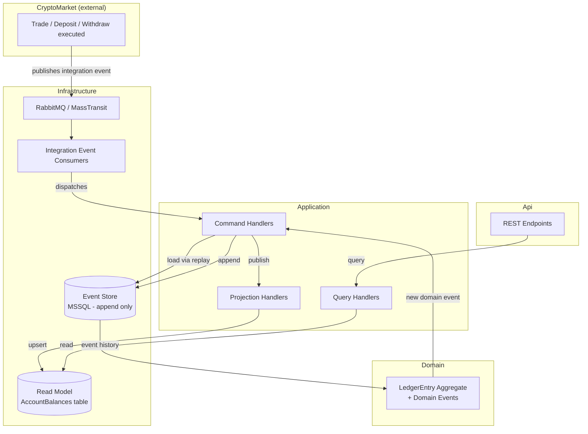

# LedgerFlow
 
An event-sourced ledger/audit service built with .NET, designed as a companion to the [CryptoMarket](#) project. LedgerFlow consumes trade, deposit, and withdrawal events and maintains an immutable, append-only record of every financial movement — enabling full audit trails and point-in-time balance queries that a traditional CRUD-based wallet cannot provide.
 
## Why this project exists
 
CryptoMarket's `Wallet` aggregate holds the *current* state of a user's balance — accurate, but it only ever answers "what do I have right now?" Once a value is overwritten, the path that led to it is gone.
 
LedgerFlow answers a different question: **"how did we get here?"**
 
Every deposit, withdrawal, and trade is stored as an immutable event. Nothing is ever updated or deleted — only appended. The current balance is not stored directly; it's *derived* by replaying the event history. This unlocks capabilities a mutable model can't offer:
 
- **Full audit trail** — every state change is permanently recorded, in order.
- **Point-in-time queries** — "what was the balance on July 10th?" is answered by replaying events up to that point.
- **Non-destructive corrections** — mistakes are never edited away; they're corrected with a new, compensating event, preserving the full history.
LedgerFlow does not duplicate wallet logic. It's a separate bounded context that subscribes to integration events published by CryptoMarket and builds its own ledger from them.
 
## Architecture
 
The solution follows **Clean Architecture** as a modular monolith, with a clear CQRS split between the write side (event-sourced commands) and the read side (projected query models).
 

 
### Layers
 
| Layer | Responsibility | Depends on |
|---|---|---|
| **Domain** | `LedgerEntry` aggregate, domain events, value objects (`Money`). Zero external dependencies — pure C#. | — |
| **Application** | Command/query handlers (MediatR), interfaces for persistence (`IEventStore`, `IReadModelRepository`). Framework-agnostic. | Domain |
| **Infrastructure** | Event store (Dapper + MSSQL), read model repository, MassTransit consumers, event serialization. | Application, Domain |
| **Api** | REST endpoints for querying account balances/history and for manually issuing correction commands. | Application, Infrastructure |
 
The dependency rule is strict: `Domain` knows nothing about the outside world, `Application` knows nothing about *how* persistence or messaging is implemented — only that it exists, via interfaces. `Infrastructure` provides the concrete implementations.
 
## Event Sourcing & CQRS in practice
 
- **Write side**: An integration event (e.g. `TradeExecuted`) arrives via MassTransit → a consumer translates it into a domain command → the command handler replays the aggregate's event stream, applies the business rule, and appends a new domain event to the store.
- **Concurrency control**: Enforced at the database level via a `UNIQUE(StreamId, Version)` constraint — a classic optimistic concurrency pattern, applied to event streams instead of row versions.
- **Read side**: Domain events are also published as MediatR notifications to projection handlers, which update a denormalized `AccountBalances` table — fast to query, always derived from (and secondary to) the event store.
## Tech Stack
 
- .NET / C#
- MSSQL (event store + read model)
- Dapper (no ORM — raw SQL, explicit control over event store semantics)
- MassTransit + RabbitMQ (integration events from CryptoMarket)
- MediatR (in-process command/query/notification dispatch)
## Project Structure
 
```
LedgerFlow.sln
├── LedgerFlow.Domain            # Aggregates, domain events, value objects
├── LedgerFlow.Application       # Commands, queries, handler interfaces
├── LedgerFlow.Infrastructure    # Event store, read model, MassTransit consumers
└── LedgerFlow.Api               # REST endpoints
```
 
## Status
 
Work in progress — built as a learning project to apply Event Sourcing and CQRS patterns in a realistic domain, alongside the existing CryptoMarket portfolio project.
 
## Related
 
- [CryptoMarket](#) — the primary trading platform this service audits.
